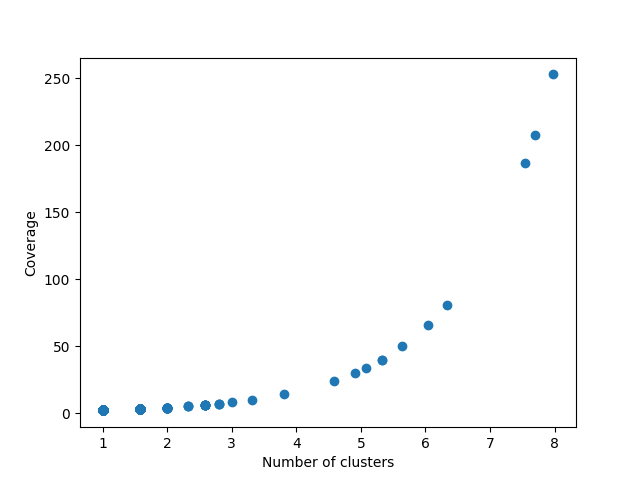
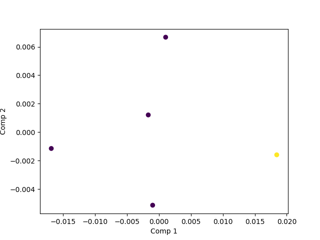

<p align="center"></p>

<h1 align="center">MITochondrial NANopore reads EXtractor</h3>

<div align="center">

  []() 
  [](https://github.com/juanjo255/MITNANEX/issues)
  [](https://github.com/juanjo255/MITNANEX/pulls)
  [](/LICENSE)

</div>

---

## Table of Contents
+ [About](#about)
+ [Getting Started](#getting_started)
+ [Usage](#usage)
+ [Algortihm overview](#algortihm_overview)
+ [Contributing](../CONTRIBUTING.md)

## 🧐 About <a name = "about"></a>
MITNANEX's main purpose is to extract mitocondrial Nanopore reads from the **WGS _De novo_**. However, it will also returned a draft assembly of the mitogenome using [Flye](https://github.com/fenderglass/Flye.git).

## 🏁 Getting Started <a name = "getting_started"></a>

### Installing

#### Conda/mamba

The best way to use the program is throught a beautiful conda/mamba enviroment.

```
git clone https://github.com/juanjo255/MITNANEX.git && cd MITNANEX
bash setup.sh
```
### Dependencies
MITNANEX needs the following tools:
1. Seqkit
2. Seqtk
3. Minimap2
4. Miniasm
5. Flye
6. Pandas
7. Gfastats
8. Canu
9. Samtools

**Notes:** 

+ This has only been tested on MacOS M1.
  
+ ```setup.sh``` will create a **mamba** enviroment with all the dependencies in the  ```.yml``` file.

## 🎈 Usage <a name="usage"></a>

* Quick start
  ```
  ./mitnanex_cli.sh -i path/to/fastQ  -p 15000 -m 1000 -t 8 -s 0.6 -g GenomeSize(g|m|k) -w path/to/output
  ```
**Notes:** 
+ It only receives fastQ files.

* For help message
  ```
  ./mitnanex_cli.sh -h
  ```
  ```
    Options:
        -i        Input file. [required]
        -t        Threads. [4].
        -p        Proportion. For sampling. It can be a proportion or a number of reads (0.3|10000). [0.3].
        -m        Min-len. Filter reads by minimun length. Read seqkit seq documentation. [-1].
        -M        Max-len. Filter reads by maximun length. Read seqkit seq documentation. [-1].
        -w        Working directory. Path to create the folder which will contain all mitnanex information. [./mitnanex_results].
        -r        Prefix name add to every produced file. [input file name].
        -c        Coverage. Minimum coverage per cluster accepted. [-1].
        -d        Different output directory. Create a different output directory every run (it uses the date and time). [False]
        -s        Mapping identity. Minimun identity between two reads to be store in the same cluster.[0.6]
        -q        Min mapping quality (>=). This is for samtools. [-1].
        -f        Flye mode. [--nano-hq]
        -g        GenomeSize. This is your best estimation of the mitogenome for read correction with Canu. [required]
        *         Help.
  
  ```

  ## Algorithm overview
  ### **How does MITNANEX work?**
  + MITNANEX is a pipeline that depends on other open source tools (see [dependencies](#getting_started)).
  + Through this I will show the results that belong to the assemble of Talaromyces santanderensis mitogenome using MITNANEX from a Nanopore run performed at EAFIT university.
  + First, it will use seqkit and seqkt to subsample the reads, after that  MITNANEX starts with minimap2 finding overlaps between reads. MITNANEX will group reads that have at least certain level of identity (tweakable parameter), each read will be counted for the "coverage" of the group and each cluster will be represented only by its largest read.
  + Once we got the clusters, we will only keep at least 3 groups with the highest coverage (tweakable parameter), given the short length of the mitchondrial genome and its high coverage during WGS, we expect to have most of it in these clusters.
  + <p align="center"></p>
  + Now with the selected clusters MITNANEX will use the representative read of each cluster and get its trinucleotidic composition (codon) which will be reduce is normalized by the read length, and reduce its dimensionality to 2 with a PCA such as the classic strategy during metagenomic binning. Here, given the difference between mitochondrial and the nuclear genome, we expect the mitochondrial reads to have an oligocomposition different enough to be separated from the nuclear. The known weakness of Kmean for outliers made the selection of this clustering algortihm attractive. Thus, using the clustering algorithm Kmeans, with a k set to 2, is selected the cluster with the highest coverage. Below the cluster in yellow was selected.
  + <p align="center"></p>
  + With the reads collected in the cluster selected, miniasm will assemble unitigs 
     
 


